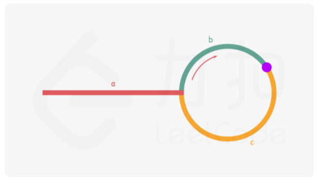
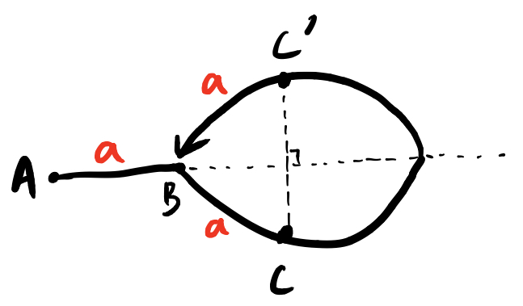

[toc]

# LinkedList 链表

通过 LinkedNode 连起来

```java
public class ListNode {
    int val;
    ListNode next;
    ListNode() {}
    ListNode(int val) { this.val = val; }
    ListNode(int val, ListNode next) { this.val = val; this.next = next; }
}
```

无法高效获取长度，无法根据偏移快速访问元素，是链表的两个劣势。然而面试的时候经常碰见诸如获取倒数第k个元素，获取中间位置的元素，判断链表是否存在环，判断环的长度等和长度与位置有关的问题。这些问题都可以通过灵活运用双指针来解决。

**Tips：双指针并不是固定的公式，而是一种思维方式~**

链表是空节点，或者有一个值和一个指向下一个链表的指针，因此很多链表问题可以用**递归**来处理。

递归的一个重要思想就是：**相信函数**。

***

**难题复杂的题，可能有一种情况是：**

- **分模块处理，搞一些简单的小函数，分而治之，大问题拆分成一个一个的小问题。**

***

## 160. Intersection of Two Linked Lists (Easy) 链表交点

链表经典题，链表交点！

例如以下示例中 A 和 B 两个链表相交于 c1：

```
A:          a1 → a2
                    ↘
                      c1 → c2 → c3
                    ↗
B:    b1 → b2 → b3
```

要求时间复杂度为 O(N)，空间复杂度为 O(1)。如果不存在交点则返回 null。

设 **A** 的长度为 **a + c**，**B** 的长度为 **b + c**，其中 c 为尾部公共部分长度，可知 **a + c + b = b + c + a**。

**数学思想！**

当访问 A 链表的指针访问到链表尾部时，令它从链表 B 的头部开始访问链表 B；同样地，当访问 B 链表的指针访问到链表尾部时，令它从链表 A 的头部开始访问链表 A。这样就能控制访问 A 和 B 两个链表的指针能同时访问到交点。

如果不存在交点，那么 a + b = b + a，以下实现代码中 l1 和 l2 会同时为 null，从而退出循环。

也就是说当不想交时，我们也认为是相交于 null

```
A:          a1 → a2
                    ↘
                      null
                    ↗
B:    b1 → b2 → b3
```

```java
public ListNode getIntersectionNode(ListNode headA, ListNode headB) {
    ListNode l1 = headA, l2 = headB;
    while (l1 != l2) {
        l1 = (l1 == null) ? headB : l1.next;
        l2 = (l2 == null) ? headA : l2.next;
    }
    return l1;
}
```

如果是是否相交，就是另外一个题了，有两种解法：

- 把第一个链表的结尾连接到第二个链表的开头，看第二个链表是否存在环；
- 或者直接比较两个链表的最后一个节点是否相同。


## 206. Reverse Linked List (Easy) 翻转

**方法一：递归，递归思想在链表相关的东西中至关重要！！！**

链表的东西，可以多想想递归，因为链表这个东西本身就是递归的。

递归的思想就是，我只做一点，把剩下的东西交给函数再去做。

```java
    public ListNode reverseList(ListNode head) {
        if (head == null || head.next == null) return head;
        ListNode next = head.next;
        ListNode newHead = reverseList(head.next);
        next.next = head;
        head.next = null;
        return newHead;
    }
```

这里注意 next 和 newHead 那些东西

**方法二：迭代，原地翻转**

```java
    public ListNode reverseList2(ListNode head) {
        ListNode pre = null;
        while (head != null) {
            ListNode next = head.next;
            head.next = pre;
            pre = head;
            head = next;
        }
        return pre;
    }
```

这里注意是让 head 走到了最后，最后返回的有效的是 pre 指针

这里也是用到了**双指针**的思想，这里就两个指针，next 就是个纪录


## 21. Merge Two Sorted Lists (Easy) 递归和迭代（循环）两种！

最简单的，直接递归，相信函数。

```java
// recursion Time: O(m+n) Space: O(m+n)
public ListNode mergeTwoLists(ListNode list1, ListNode list2) {
    if (list1 == null) return list2;
    if (list2 == null) return list1;
    if (list1.val < list2.val) {
        list1.next = mergeTwoLists(list1.next, list2);
        return list1;
    } else {
        list2.next = mergeTwoLists(list2.next, list1);
        return list2;
    }
}
```

**时间复杂度 O(m+n) 空间复杂度 O(m+n)**

递归的思路虽然非常简单，但是函数调用栈会占用额外的内存空间，递归调用 mergeTwoLists 函数时需要消耗栈空间，栈空间的大小取决于递归调用的深度。结束递归调用时 mergeTwoLists 函数最多调用 n+m 次，因此空间复杂度为 O(n+m)

```java
// iteration Time: O(m+n) Space: O(1)
    public ListNode mergeTwoLists2(ListNode list1, ListNode list2) {
        ListNode head = new ListNode(-1, null);
        ListNode pre = head;
        while (!(list1 == null && list2 == null)) {
            if (list1 == null) {
                pre.next = list2;
                return head.next;
            }
            if (list2 == null) {
                pre.next = list1;
                return head.next;
            }
            if (list1.val < list2.val) {
                pre.next = list1;
                list1 = list1.next;
            } else {
                pre.next = list2;
                list2 = list2.next;
            }
            pre = pre.next;
        }
        return head.next;
    }
```

**时间复杂度 O(m+n) 空间复杂度 O(1)**

迭代其实也是非常非常简单的思想，最简单的思想就是迭代（循环）的思想，但实际实现的时候要注意一些细节：

* head 弄一个最头部的哑节点，这样最头部这里就不用伤脑筋了，直接用实在的数据结构解决了

* pre 记录前一个
* 每一个怎么往下走
* （写代码小技巧：可以先不考虑特殊情况，先按最理想的情况写，然后之后再修修补补考虑特殊情况）


## 83. Remove Duplicates from Sorted List (Easy) 递归，迭代

**递归**

```java
    // recursion
    public ListNode deleteDuplicates(ListNode head) {
        if (head == null || head.next == null) return head;
        head.next = deleteDuplicates(head.next);
        if (head.val == head.next.val) {
            return head.next;
        }
        else {
            return head;
        }
    }
```

相信函数即可，从第二个开始弄，弄完了以后和第一个比一下，看看怎么样，重的话删掉一个。

时空都是 O(n)

**迭代**

```java
    // iteration 2
    public ListNode deleteDuplicates3(ListNode head) {
        if (head == null || head.next == null) return head;
        ListNode left = head;
        ListNode right = head.next;
        while (right != null) {
            if (left.val != right.val) {
                left = left.next;
                right = right.next;
            } else {
                right = right.next;
                left.next = right;
            }
        }
        return head;
    }
```

这里的迭代，具体操作就是**双指针**，左右指针，往下走，特殊处理重复的！


## 19. Remove Nth Node From End of List (Medium) 双指针 快慢指针

倒数第几个，标准哑节点，快慢指针。

1. **哑结点**的巧妙应用
   * 链表删除添加等问题，在操作第一个或最后一个时
   * 常出现**找不到前一个**或者**找不到后一个**的问题
   * 这个添加哑结点，就是保证了一定会有前一个
   * 所以这里就要利用哑结点提供的这个**一致条件**（都有前一个） 
   * 找要删除的结点的前一个 

2. 一遍遍历，双指针，快慢指针
   * 通过**快慢指针**的距离找到要删除的结点的前一个
     * 让两个指针保持一个距离，没错，刚好是 k 距离
   * 然后正常删除
   * 返回哑结点的next

```java
// Two pointers
    public ListNode removeNthFromEnd(ListNode head, int n) {
        ListNode dummy = new ListNode(-1, head);
        ListNode left = dummy;
        ListNode right = dummy;
        while (n-- > 0) {
            right = right.next;
        }
        while (right.next != null) {
            left = left.next;
            right = right.next;
        }
        left.next = left.next.next;
        return dummy.next;
    }
```


## 24. Swap Nodes in Pairs (Medium)

```
Given 1->2->3->4, you should return the list as 2->1->4->3.
```

题目要求：不能修改结点的 val 值，O(1) 空间复杂度。

如果不看时间复杂度要求的话，还是 recursion 和 iteration 两种做法，recursion 这种方法，非常简单，但是占内存空间，这种方法就不说了。

这种简单题的话，做就直接找最优解！循环做，保证不占用额外的空间。

```java
    // iteration
    public ListNode swapPairs(ListNode head) {
        if (head == null || head.next == null) return head;
        ListNode dummy = new ListNode(-1, head);
        ListNode pre = dummy;
        ListNode left = head;
        ListNode right = head.next;
        while (left != null && right != null) {
            pre.next = right;
            left.next = right.next;
            right.next = left; // 这三句是在掰 LinkedNode 的 next 箭头
            pre = left;
            left = left.next;
            right = left == null ? null : left.next; // 这三句是移动三个指针
        }
        return dummy.next;
    }
```

依旧是应用了哑节点，避免前面少一个。


## 445. Add Two Numbers II (Medium) 栈

```
Input: (7 -> 2 -> 4 -> 3) + (5 -> 6 -> 4)
Output: 7 -> 8 -> 0 -> 7
```

题目要求：不能修改原始链表。

堆栈的使用，大体思路：把两个数的东西放入 stack 中，然后再取出，相加，合成新的数。

使用栈，问题的思路非常简单，编程实现即可。

```java
		public ListNode addTwoNumbers(ListNode l1, ListNode l2) {
        Stack<Integer> stack1 = getStackByLinkedList(l1);
        Stack<Integer> stack2 = getStackByLinkedList(l2);
        ListNode res = null;
        int carry = 0;
        while (!stack1.isEmpty() || !stack2.isEmpty() || carry != 0) {
            int x = stack1.isEmpty() ? 0 : stack1.pop();
            int y = stack2.isEmpty() ? 0 : stack2.pop();
            int remainder = (x + y + carry) % 10;
            carry = (x + y + carry) / 10;
            res = new ListNode(remainder, res);
        }
        return res;
    }
    private Stack<Integer> getStackByLinkedList(ListNode l1) {
        Stack<Integer> res = new Stack<>();
        while (l1 != null) {
            res.push(l1.val);
            l1 = l1.next;
        }
        return res;
    }
```

这种题就属于思路非常简单，编程难度也不大，意义不大吧可能。

这种方法的缺点是会占用额外的内侧。

如果不允许这样的话，如果可以修改原链表，也可以考虑反转，然后再加。当然了，最简单的实现还是用 stack，问题就变得非常简单了。


## 234. Palindrome Linked List (Easy) 回文链表 中点 翻转 比较是否相等

题目要求：以 O(1) 的空间复杂度来求解。

切成两半，把后半段反转，然后比较两半是否相等。

**解析：**此题涉及到了很多基本的重要的链表的基本技巧包括：

* 快慢指针，寻找中间点，切断
* 翻转
* 比较两个链表是否 equal

传统方法的代码：（属于经典的 **逻辑简单，编程复杂的方法**，是对编程基本功基本函数的考验，编程基本功一定要扎实！！）

```java
public boolean isPalindrome(ListNode head) {
        if (head == null) return false;
        if (head.next == null) return true;
        ListNode midPointer = findMidPointerAndCut(head);
        ListNode head2 = reverse(midPointer);
        return isEqual(head, head2);
    }

    private ListNode findMidPointerAndCut(ListNode head) {
        ListNode left = head;
        ListNode right = head.next;
        while (right != null && right.next != null) {
            left = left.next;
            right = right.next.next;
        }
        ListNode res = left.next;
        left.next = null;
        return res;
    }

    private ListNode reverse(ListNode head) {
        ListNode newHead = null;
        while (head != null) {
            ListNode nextNode = head.next;
            head.next = newHead;
            newHead = head;
            head = nextNode;
        }
        return newHead;
    }

    private boolean isEqual(ListNode l1, ListNode l2) {
        while (l1 != null && l2 != null) {
            if (l1.val != l2.val) return false;
            l1 = l1.next;
            l2 = l2.next;
        }
        return true;
    }
/*
对几个子函数的说明：
    总体思路：切成两半，把后半段反转，然后比较两半是否相等
    1.cut 函数：
        这个函数在 cutNode 处 cut，使 cutNode 前面的执政不再指向他而是指向 NULL 来完成 cut
    2.reverse 函数：
        经典的链表翻转，下面写法不利用任何额外空间，仅仅在原链表上通过指针的变换完成翻转！！（顶！！！！！）
    3.isEqual 函数：
        这个函数的精髓在于，判断一样的返回 true，如果有一个多一个结点，但前面两者都一样，也 true
        （这样就统一解决了奇数偶数的问题！！）
*/
```


一个创意做法，虽然最后被证明还是有bug，该方法不行。

但是两年前的这个创意，这种新奇的通过索引奇偶数情况做题的方式，实在让人佩服！佩服自己两年前自己的这种创造性。

涉及到回文的东西，通过索引来做题，把数的内容直接作为hash 的 key ，是一种非常有创造性的思想。

```java

//    public boolean isPalindrome2(ListNode head) {
//        if (head == null) return false;
//        if (head.next == null) return true;
//        long[] arr = new long[10];
//        long count = 0;
//        while (head != null) {
//            count++;
//            arr[head.val] += count;
//            head = head.next;
//        }
//        if (count % 2 == 1) {
//            for(long element: arr) {
//                if (element % (count / 2 + 1) != 0) return false;
//            }
//            return true;
//        } else {
//            for(long element: arr) {
//                if (element % (count + 1) != 0) return false;
//            }
//            return true;
//        }
//    }

    /*
        纪念一下曾经的自己吧，这个方法不可取，有 bug，但永远纪念自己的创意，热爱创意

        以下是自己想出的一种巧妙方法，但可惜之处在于这种方法只能解决数值是 0-9 的情况
        因为运用了哈希表，所以就有了数值的局限性
        但他一遍走完通过 index 存在的某种数学关系完成判断
        属于 “ 逻辑复杂，编程简单 ” 的情况
    */


//    class Solution {
//        public:
//        bool isPalindrome(ListNode* head) {
//            int arr[10];
//            for(int i = 0; i < 10; i++) arr[i] = 0;
//            ListNode* iPoint = head;
//            int count = 0;
//            while(iPoint){
//                count++;
//                arr[iPoint->val] += count;
//                iPoint = iPoint->next;
//            }
//            if(count % 2 == 1){
//                for(int i = 0; i < 10; i++){
//                    if(arr[i] % (count/2 + 1) != 0) return false;
//                }
//                return true;
//            }else{
//                for(int i = 0; i < 10; i++){
//                    if(arr[i] % (count + 1) != 0) return false;
//                }
//                return true;
//            }
//        }
//    };
```

希望能永久保持对  “ 逻辑复杂，编程简单 ” 方法的追求。


## 725. Split Linked List in Parts(Medium)

输入：head = [1,2,3], k = 5
输出：[[1],[2],[3],[],[]]
解释：
第一个元素 output[0] 为 output[0].val = 1 ，output[0].next = null 。
最后一个元素 output[4] 为 null ，但它作为 ListNode 的字符串表示是 [] 。

输入：head = [1,2,3,4,5,6,7,8,9,10], k = 3
输出：[[1,2,3,4],[5,6,7],[8,9,10]]
解释：
输入被分成了几个连续的部分，并且每部分的长度相差不超过 1 。前面部分的长度大于等于后面部分的长度。

**标准的逻辑极简，编程复杂，考察编程基本功的题目**

说一下编程中的几个代码细节：

* 计数这件事，对于这道题来说，属于是没法避免了，只能是走这一遍了
* 算商，算余数
* 搞每一组，这里注意每组是走了 currentSize - 1，总之各种走的时候要注意是不是 null 这是关键细节！

```java
public ListNode[] splitListToParts(ListNode head, int k) {
        ListNode[] res = new ListNode[k];
        int count = 0;
        ListNode iteratorOfCount = head;
        while (iteratorOfCount != null) {
            count++;
            iteratorOfCount = iteratorOfCount.next;
        }
        ListNode iterator = head;
        int remainder = count % k;
        int quotient = count / k;
        for (int i = 0; i < k; i++) {
            res[i] = iterator;
            int currentSize = quotient + (remainder-- > 0 ? 1 : 0);
            for (int j = 0; j < currentSize - 1; j++) {
                if (iterator != null) {
                    iterator = iterator.next;
                }
            }
            ListNode pre = iterator;
            if (iterator != null) {
                iterator = iterator.next;
                pre.next = null;
            }
        }
        return res;
    }
```

* 这题这种写法是不错，但是不一定非得这样，也可以分简单的情况分别来处理，我最早的暴力解法就是这种，分情况来弄的，可以参看一下下面的 c++ 代码。

```c++
/*
以下是自解方法，可能稍显繁琐，逻辑和编程都有一些难度但不大，细节较多考验一些基本功
其中有一个（？ ：） 表达式比较精髓，消除了一些特例，保证统一性
*/

class Solution {
public:
    vector<ListNode*> splitListToParts(ListNode* root, int k) {
        vector<ListNode*> result;
        ListNode* countPiont = root;
        int count = 0;
        while(countPiont){
            count++;
            countPiont = countPiont->next;
        }
        countPiont = root;
        int quotient = count/k;
        int remainder = count%k;

        if(quotient == 0 || (quotient == 1 && remainder == 0)){
            for(int i = 0; i < k; i++){
                if(countPiont != NULL){
                    ListNode* temp = new ListNode(countPiont->val);
                    result.push_back(temp);
                    countPiont = countPiont->next;
                }else{
                    ListNode* temp = NULL;
                    result.push_back(temp);
                }
            }
        }else{
            for(int i = 0; i < k; i++){
                ListNode* temp = new ListNode(-1);
                ListNode* iPoint = temp;
                for(int j = 0; j < quotient + (i < remainder ? 1 : 0); j++){
                    iPoint->next = new ListNode(countPiont->val);
                    iPoint = iPoint->next;
                    countPiont = countPiont->next;
                }
                result.push_back(temp->next);
                delete temp;
            }
        }
        return result;
    }
};
```


## 328. Odd Even Linked List (Medium)

```
Example:
Given 1->2->3->4->5->NULL,
return 1->3->5->2->4->NULL.
```

给定一个单链表，把所有的奇数节点和偶数节点分别排在一起。请注意，这里的奇数节点和偶数节点指的是节点编号的奇偶性，而不是节点的值的奇偶性。

请尝试使用原地算法完成。你的算法的空间复杂度应为 O(1)，时间复杂度应为 O(nodes)，nodes 为节点总数。

***

当做题没思路的时候，就不要想那么多了，就用就基本的分情况讨论的方法去做题，一个算法题，即使你分类讨论分所有的情况，也最多就是分三种。

这题直接就要求的最优解，所以直接就在数据结构上操作就好了，考察编程基本功，**双指针**的复杂用法！

我分的情况就是：

* 后面一个也没有的情况即 iterationEven.next 是 null
* 后面有一个即循环能进去，但是在 break 那里处理
* 正常情况正常处理

```java
public ListNode oddEvenList(ListNode head) {
        if (head == null || head.next == null) return head;
        ListNode iterationOdd = head;
        ListNode evenHead = head.next;
        ListNode iterationEven = evenHead;
        while (iterationEven.next != null) {
            iterationOdd.next = iterationEven.next;
            iterationOdd = iterationOdd.next;
            if (iterationOdd.next != null) {
                iterationEven.next = iterationOdd.next;
                iterationEven = iterationEven.next;
            } else {
                break;
            }
        }
        iterationEven.next = null;
        iterationOdd.next = evenHead;
        return head;
    }
```


## 链表的环

### 是否有环 141 环形链表

如果有环，快慢指针只要走下去就能相遇。

我们可以这样想，当慢指针刚进入环时，也就是到达那个被两个指针指着的结点时，快指针已经在环里了，在这个时候我们可以认为快指针落后慢指针 a 步，那么自此再走 a 步，两个指针一定会相遇！

```java
    public boolean hasCycle(ListNode head) {
        if (head == null || head.next == null) return false;
        ListNode slow = head;
        ListNode fast = head.next;
        while (fast.next != null && fast.next.next != null) {
            if (slow == fast) return true;
            slow = slow.next;
            fast = fast.next.next;
        }
        return false;
    }
```

### 环的结点 141 环形链表2

数学这块一定要踏下心来算！

就是快慢指针，双指针，各种来回走，最后同时指到结点那个！这里具体走的情况要画画图，好好数学算一下。

力扣解释：

我们使用两个指针，$fast$ 与 $slow$。它们起始都位于链表的头部。随后，$slow$ 指针每次向后移动一个位置，而 $fast$ 指针向后移动两个位置。如果链表中存在环，则 $fast$ 指针最终将再次与 $slow$ 指针在环中相遇。

如下图所示，设链表中环外部分的长度为 a。 $slow$ 指针进入环后，又走了 b 的距离与 $fast$ 相遇。此时，$fast$ 指针已经走完了环的 n 圈，因此它走过的总距离为
$$
a+n(b+c)+b=a+(n+1)b+nc=a+(n+1)b+nc
$$


根据题意，任意时刻，$fast$ 指针走过的距离都为 $slow$ 指针的 2 倍。因此，我们有
$$
 a+(n+1)b+nc=2(a+b)⟹a=c+(n−1)(b+c)
$$
有了 a=c+(n-1)(b+c)a=c+(n−1)(b+c) 的等量关系，我们会发现：从相遇点到入环点的距离加上 n−1 圈的环长，恰好等于从链表头部到入环点的距离。

因此，当发现$slow$ 与 $fast$ 相遇时，我们再额外使用一个指针 $ptr$。起始，它指向链表头部；随后，它和 \textit{slow}slow 每次向后移动一个位置。最终，它们会在入环点相遇。

**结论：**得出的结论就是，快慢指针相遇后，一个指针从头开始走，一个从相遇点开始走，这两个再碰上的时候，就是环结点的地方。

我的解释：假设 slow 刚到 B 点时，fast 在 C 点，那么它们在哪里相遇呢，毫无疑问，是在环的对称点 C' 点，细品即可，会在这个点相遇，而这个点距离 B 刚好是长度 a ，这样的话，让两个指针走同时走到 B 相遇即可。



* 这种题还是要多画图，多想多算！

### 环的长度

通过上面的东西，我们已经明白了，我们可以认为整个过程是 fast 从后面追 slow，然后环的长度是多少呢，相遇一次后，再继续走，下一次再遇到时，刚好是 slow 走了一圈，fast 走了两圈（因为你可以想见，slow 走半圈时，fast 是走一圈），从第一次相遇到第二次相遇，slow 刚好走了一圈，记录下这个步数，就是环长。

