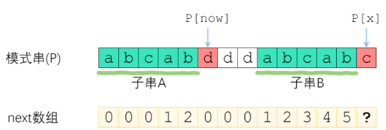

[toc]

# String 字符串

用的是 Java 的 String 类（这里也跟着学习一下 Java 的各种字符串操作）。

## KMP 字符串匹配算法

*永远不要上来就开始摆术语，公式，代码，说这个题应该怎么怎么做，而不说为什么，这是我们国人常犯的错误；一切要从最开始的想法开始说，然后一点一点的优化，才有了最终的解决方法，这才是一个正确的思考过程，而不是机械的背方法，看到什么题就用什么方法，那是不对的，要注重从最开始的思考的过程。*

*一切从最开始的海滩上捡贝壳的孩子开始，从贝壳开始，而不是从收音机的各个部件都叫什么开始。*

***

### KMP 的意义，解决的问题

首先我们说，KMP 解决的问题是：解决字符串匹配问题，就是类似 28 strStr 的问题

意义：

* 其他流行的解决方法的时间复杂度都是 $O(n^2)$ 平方的
* KMP 可以把时间复杂度做到 $O(n)$ 线性的

### KMP 解析

首先我们思考最初始的暴力匹配的方法，这种方法的问题在于，当我们一次匹配失败后，我们要从在主串上往回走，这导致了平方的时间复杂度，KMP 就是为了解决这个问题，让我们在主串上能够不回头的一直向前走，达到线性的时间复杂度。

#### 传统方法

传统方法：


那么如何优化这个算法呢？这里我引用知乎题解里的一句话：

> 要优化一个算法，首先要回答的问题是“我手上有什么信息？”　我们手上的信息是否足够、是否有效，决定了我们能把算法优化到何种程度。请记住：**尽可能利用残余的信息，是[KMP算法](https://www.zhihu.com/search?q=KMP算法&search_source=Entity&hybrid_search_source=Entity&hybrid_search_extra={"sourceType"%3A"answer"%2C"sourceId"%3A1032665486})的思想所在**。

传统方法之所以如此低效的原因就是，传统方法的这种行为，属于典型的“没有从之前的错误中学到东西”。

我们接下来要做的就是，**从失败中学到东西！**

#### 从失败中学到东西，利用失败时产生的信息

从之前的匹配中，我们可以认识到从哪里匹配是必定不会成功的，认识到这点，我们要从有可能成功的点上开始重新匹配，比如下面这种情况：


* 当我们第一次匹配失败后，我们就知道，如果下次从 1 开始匹配会必然失败，我们要从 2 开始匹配，并且已经可以直接比较 主串[2] 和 模式串[1] 了
* 第二次匹配失败后，我们知道我们下一次可以从主串 5 开始匹配，并且可以直接比较主串 8 和 模式串 3 了

达到这个效果，我们就可以把时间复杂度变成线性了，因为这样的话，主串是不回头的一直往下走的

接下来的问题在于，我们如何知道下一次匹配从哪里开始匹配，也就是说，我们怎么样知道这次匹配失败后应该把标尺（模式串 P 就是标尺）移动多少（传统方法是每次失败后把标尺移动1），KMP 的改进就在于每次都尽量多的移动标尺。

这里要需要我们做一些**记录**，才让我们知道从哪里开始匹配，这个记录我们称其为 next数组，该数组的每个元素对应模式串的每个字符（该数组只与标尺即模式串 P 有关）。

#### next 数组定义

为了方便理解，我们这样定义 next 数组：

> next[i] 表示 P[0] ~ P[i] 这一个子串，使得 **前k个字符**恰等于**后k个字符** 的最大的k. 特别地，k不能取i+1（因为这个子串一共才 i+1 个字符，自己肯定与自己相等，就没有意义了）。

我们依旧以这个题目为例：


对于该题目的next 数组：

| next[i] | **前k个字符**恰等于**后k个字符** 的最大的k |
| ------- | ------------------------------------------ |
| 0 a     | 0                                          |
| 1 b     | 0                                          |
| 2 a     | 1                                          |
| 3 a     | 1                                          |
| 4 b     | 2                                          |
| 5 a     | 3                                          |
| 6 c     | 0                                          |

得到这个 next 数组，我们也就基本解决了这个问题。

#### next 数组的构建

（构建这个数据有暴力的时间复杂度平凡的暴力算法，这里就不说了，直接开始讲解时间复杂度线性的方法）

快速构建next数组，是KMP算法的精髓所在，核心思想是“**P自己与自己做匹配**”。

在定义中，不知不觉地就包含了一个匹配——前缀和后缀相等。这意味着我们要使用之前利用过的信息，接下来，我们考虑采用递推的方式求出next数组。如果next[0], next[1], ... next[x-1]均已知，那么如何求出 next[x] 呢？

这里分为两种情况，第一种情况为**顺延**：


我们走到 P[x] 时，可以找到 next[x-1]（以下记为now），如果 P[x] 与 P[now] 一样（这里有一个思想上的转化，我们找到的 next[x-1] 值其实可以认为是 pattern 串的一个索引找打相应的元素），那最长相等前后缀的长度就可以扩展一位，很明显 next[x] = now + 1。

>因此这里也可以补充一句 next 数组的定义，next[x] 的值表示如果这个字符在前后缀匹配的子字符串中，那么下一个要比较的字符的位置。那些是 0 的，其实意思就是这个字符不在已经匹配的字符串中，下一个字符直接从 P[0] 开始比较吧。

这个就是顺延的情况

第二种情况是**找子字符的顺延：**

例如这种情况



我们无法继续顺延了，但我们知道字符串A和字符串B肯定是一样的，那么就相当于，接下来我们要在这个新的子串里找前后缀匹配。


这时我们就要认为 P[X] 是在红色的 d 处，我们要 P[x - 1] 就是红 d 前面的 b，我们找到的新的 now 就是 2，然后再看能不能顺延：


来看上面的例子可以看出，当P[now]与P[x]不相等的时候，我们需要缩小now——把now变成next[now-1]，直到P[now]=P[x]为止。P[now]=P[x]时，就可以直接顺延了。

> 这里我补充说明一下这个 now 的定义的，now 就是 P[x] 的上一个字符对应的前缀的后面一个字符的指针，当不能顺延时，now 就要缩小，变成更小的子串里的指针。（这里我愿称其为 next 数组跳转，或者按你理解的一直一半一半的切）
>
> 我理解为 now 是指针！
>
> 当子字符串不断缩小，缩小到没有自身的前后缀匹配时，比如该题中 P[x] 是e，那么子字符串 ab 中没有自身的前后缀匹配了（我们可以通过 next[now - 1] == 0 来得到这个信息）这种情况下 next[x] 就赋值为 0。

至此，我们就构建好了 next 数组

>关于构建 next 数组的时间复杂度问题，确实在匹配失败时，字符串不往下走了，而是产生 next 数组跳转，但是即使算上这些多出来的时间，总的时间复杂度也不会超过 2m，因为你每切（跳转）一次都伴随着一次成功的匹配，平均过去之后，最多也就是 2m。
>
>所以这里为暂时说服自己构建 next 数组的时间复杂度是 O(m)

```java
    private int[] getNextArr(String pattern) {
        int length = pattern.length();
        int next[] = new int[length];
        if (length == 0) return next;
        next[0] = 0;
        int i = 1, now = 0;
        while (i < length) {
            if (pattern.charAt(i) == pattern.charAt(now)) {
                now++;
                next[i] = now;
                i++;
            } else if (now != 0) {
                now = next[now - 1];
            } else {
                next[i] = now;
                i++;
            }
        }
        return next;
    }
```

#### 通过 next 数组匹配字符串

这里写代码时注意：

* 每次标尺向前推时，position 的变化情况
* 并不是每次 i 都加一

```java
    public int search(String haystack, String needle) {
        int next[] = getNextArr(needle);
        int lengthOfS = haystack.length();
        int lengthOfP = needle.length();
        if(lengthOfP == 0) return 0;
        int position = -1;
        int i = 0, j = 0;
        while (i < lengthOfS) {
            if (haystack.charAt(i) == needle.charAt(j)) { //匹配成功，两个字符串都往下走
                if(j == 0) position = i;
                if(j == lengthOfP - 1) return position;
                i++;
                j++;
            } else { // 标尺不指着 0，推标尺，主字符串不往下走
                if (j != 0){
                    int old_j = j;
                    j = next[j - 1];
                    position += (old_j - j);
                } else { // 标尺指着 0，只推主字符串
                    i++;
                }
            }
        }
        return -1;
    }
```


## Manacher 寻找最长回文子串（中心扩散改进）

**改进中心拓展法，想办法让算法一直不回头的往下走，让时间复杂度达到线性。**

> 这个思想怎么来呢，同样的，我们要从利用前面出现过的信息

核心的思想在于，中心拓展的时候记录一些东西，下次再中心拓展的时候，用到之前的东西，不用再从搞过的地方重新弄，用上之前得出过的所有结果。

那么我们从之前的中心拓展中可以学到什么，可以通过对称学到这次的中心拓展是否结束，或者从哪里开始。

这里我们用两个变量：

* center 上次中心拓展的中心，比如下面的 j
* minRightOutsider 上一次中心拓展得到字符串的最小的最右的外边一个，比如下面的最右边的 e
  * 我们就是用这个 minRightOutsider 证明我们是线性的只走一次的

比如下面这种情况：


通过对称我们知道，i 的中心拓展的东西，一定是包含在上次拓展的字符串里面了，所以肯定 i 就不用中心拓展了，就和上次对称的一样就行了。

比如这种情况：


这种的话，可以看到从 i 开始中心拓展的话，一定顶到 minRightOutsider 了，所以必须继续拓展了，从 minRightOutsider 开始拓展，然后完成这次拓展。

最后每次 i 拓展为完成后，都产生新的 minRightOutsider ，和之前的比较一下，如果大于之前的，那么就更新center 和 minRightOutsider。

总体而言最关键的就是下面这段代码：

```java
        // 开始manacher式的中心拓展
        int center = 0, minRightOutsider = 0, newMinRightOutsider = 0;

        for (int i = 1; i < lengOfLongStr - 1; i++) {
            if (minRightOutsider > i) radius[i] = Math.min(radius[2 * center - i], minRightOutsider - i);
            else radius[i] = 1;
            while (longString.charAt(i + radius[i]) == longString.charAt(i - radius[i])) radius[i]++;
            newMinRightOutsider = i + radius[i]; // 从 i 中心拓展后得到新的 min right outsider
            if (newMinRightOutsider > minRightOutsider) {
                minRightOutsider = newMinRightOutsider;
                center = i;
            }
        }
```

上面这段代码的简单讲解：

1. 第一个 if ，通过对称，从之前的拓展中学到东西，直接初始化一下这次的 radius
2. while 开始新的中心拓展
3. 最后的一小段，是否更新 minRightOutsider

当然除此以外还有各种细节问题，下面是代码的细节问题的讲解：

* 给各个字符中间插上 #，给插完的字符串前后插上 & *，这样就保证都是奇数型的拓展了
* radius 数组，记录以 i 为中心的拓展出来的字符串的半径
* 得到 radius 数组后，对其还要各种处理，详情见代码

```java
    public void manacher(String s) {

        int length = s.length();

        // 给原字符串中间插#
        StringBuffer t = new StringBuffer("&#");
        for (int i = 0; i < length; ++i) {
            t.append(s.charAt(i));
            t.append('#');
        }
        t.append('*');
        String longString = t.toString();
        int lengOfLongStr = longString.length();

        // 半径数组
        int radius[] = new int[length * 2 + 3];

        // 开始manacher式的中心拓展
        int center = 0, minRightOutsider = 0, newMinRightOutsider = 0;

        for (int i = 1; i < lengOfLongStr - 1; i++) {
            if (minRightOutsider > i) radius[i] = Math.min(radius[2 * center - i], minRightOutsider - i);
            else radius[i] = 1;
            while (longString.charAt(i + radius[i]) == longString.charAt(i - radius[i])) radius[i]++;
            newMinRightOutsider = i + radius[i]; // 从 i 中心拓展后得到新的 min right outsider
            if (newMinRightOutsider > minRightOutsider) {
                minRightOutsider = newMinRightOutsider;
                center = i;
            }
        }

        // 结束，已得到 radius 数组，接下来处理结果
        int maxLength = 0, countOfPalin = 0, PositionOfLongestPalind = 0;
        for (int i = 0; i < lengOfLongStr; i++) {
            if (radius[i] > maxLength) {
                maxLength = radius[i];
                PositionOfLongestPalind = i;
            }
            countOfPalin += (radius[i] / 2);
        }
        maxLength -= 1;

        // 展示结果
        System.out.println(longString);
        for (int element: radius) System.out.print(element);
        System.out.println();
        System.out.println(maxLength);
        System.out.println(countOfPalin);
        System.out.println(PositionOfLongestPalind);

        int maxRadius = (radius[PositionOfLongestPalind] - 1) / 2;
        int realCenter = (PositionOfLongestPalind - 1) / 2;
        int beginIndex = realCenter - maxRadius;
      
        System.out.println(s);
        System.out.println(realCenter);
        System.out.println(maxRadius);
      
        String subPalind = s.substring(beginIndex, beginIndex + maxLength);
      
        System.out.println(subPalind);
    }
```


## 字符串循环移位包含 String Rotate Contain

**编程之美 3.1**

```
s1 = AABCD, s2 = CDAA
Return : true
```

给定两个字符串 s1 和 s2，要求判定 s2 是否能够被 s1 做循环移位得到的字符串包含。

### 解法一

首先说一下编程之美的高端解法：

**s1 进行循环移位的结果是 s1s1 的子字符串**（这句话是精髓），因此只要判断 s2 是否是 s1s1 的子字符串即可。

```java
    // 编程之美，高端方法，简洁方法
    private boolean IsRotateAndContain (String s1, String s2) {
        String s1s1 = s1.concat(s1);
//        System.out.println(s1);
//        System.out.println(s1s1);
        return s1s1.contains(s2);
    }
```

用到了 Java String 类的两个小函数：

* String.concat(s1)：返回一个新的，连接好的字符串
* String.contains(s1)：返回 boolean 是否包含

***

### 解法二

传统做法：

这里涉及了 Rotate 的写法，掌握 rotate 的具体实现细节即可：

```java
// 字符串的 rotate
private String RotateString (String str) {
    int lengOfStr = str.length();
    if (lengOfStr == 0 || lengOfStr == 1) return str;
    String tempStr1 = str.substring(1);
    String tempStr2 = str.substring(0,1);
    return tempStr1.concat(tempStr2);
}

// 传统方法，一次一次的 rotate，然后看每次的结果是否 contain s2
private boolean IsRotateAndContain2 (String s1, String s2) {
    int lengOfS1 = s1.length();
    for (int i = 0; i < lengOfS1; i++) {
        System.out.println(s1);
        if (s1.contains(s2)) return true;
        s1 = RotateString(s1);
    }
    return false;
}
```

这里主要就是用了 Java String 类的 substring 方法：

* substring()，也是返回一个新的字符串，这个字符串是原字符串的子字符串
  * 如果只有一个参数 就是 start index，**左闭**
  * 如果只有两个参数 就是 start index 和 end index，**左闭右开**


## 151. Reverse Words in a String 翻转字符串中的单词

```
s = "I am a student"
Return "student a am I"
```

经典题目。

### 解法一

**自解方法**：

自解方法的复杂度是 O(n) O(n)，是最容易想到的方法，就是把每个单词都拿出来，然后一个一个的放到一个新的字符串里，放的时候是栈的放法，这样就相当于翻转了。编程需要注意一些细节吧。

```java
// 最早想出的 自解方法 都是 O(n)
    public String reverseWords(String s) {
        String res = new String();
        String word = new String();
        int count = s.length();
        boolean inAWord = false;
        for (int i = 0; i < count; i++) {
            if (s.charAt(i) == ' ') {
                if (!inAWord) continue;
                else {
                    res = word + ' ' + res;
                    word = new String("");
                    inAWord = !inAWord;
                }
            } else {
                word += s.charAt(i);
                if (!inAWord) inAWord = !inAWord;
            }
        }
        if (!word.isEmpty()) {
            res = word + ' ' + res;
        }
        return res.substring(0, res.length() - 1);
    }
```

* 这里有个小技巧就是 boolean inAWord 这个 flag 的使用，这个是非常关键的。要学会这种思想来做记录。

***

### 解法二

还是同样的思想，这次从后面找到一个一个单词，然后放好，这次换一下数据结构，用 char[] ，字符串的操作用 StringBuilder。

* 涉及到字符串内部操作比较多的，建议用 StringBuilder

该方法相比第一种，性能有了大幅度提升！

```java
    // 也是传统逻辑，但是是用的 char[] 的数据结构，字符串的操作用了 StringBuilder
        // 时间性能大幅度提升
    public String reverseWords3(String s) {
        char[] charArray = s.toCharArray();
        int left = 0;
        int right = charArray.length - 1;
        StringBuilder sb = new StringBuilder();
        while (charArray[left] == ' ') left++;
        while (charArray[right] == ' ') right--;
        while (left <= right) {
            int startOfWord = right;
            while (startOfWord >= left && charArray[startOfWord] != ' ') startOfWord--;
            for (int i = startOfWord + 1; i <= right; i++) sb.append(charArray[i]);
            if (startOfWord > left) sb.append(' ');
            while (startOfWord >= left && charArray[startOfWord] == ' ') startOfWord--;
            right = startOfWord;
        }
        return sb.toString();
    }
```

***

### 解法三

**原地做法**，字符串，单词，来回翻转

这种做法其实就是大神追求空间复杂度 O(1)，希望能够在原地解题，不占用额外空间，不过这只能在 c++ 时实现，在 Java 等更高级的语言中是没法实现的，总得弄一个新的 String 来装一些东西。

```c++
        // 我把 C++ 的方法写在下面吧
    /*
一下是 leetcode 大神的原地做法
其中一些细节非常值得好好体会
思路是先一个整体的翻转，再逐个翻转单词
操作细节：
    1. 整体翻转
    2. 通过左右两个指针除去左右的空格
    3. 单词逐个翻转，两个指针，找到单词，然后 reverse 函数
    4. 一个精髓之处在于处理中间冗余空格：
        1. 完全原地操作，覆盖冗余空格，tail i 两个指针，妙至毫巅 （上提，向前覆盖）
        2. 覆盖的整个过程不会影响后面，但是前面得到了正确结果
字符串还是需要一些操作的
*/
    string reverseWords(string s) {
        reverse(s.begin(), s.end());                        //整体反转
        int start = 0, end = s.size() - 1;
        while (start < s.size() && s[start] == ' ') start++;//首空格
        while (end >= 0 && s[end] == ' ') end--;            //尾空格
        if (start > end) return "";                         //特殊情况

        for (int r = start; r <= end;) {                    //逐单词反转
            while (s[r] == ' '&& r <= end) r++;
            int l = r;
            while (s[l] != ' '&&l <= end) l++;
            reverse(s.begin() + r, s.begin() + l);
            r = l;
        }

        int tail = start;                                   //处理中间冗余空格
        for (int i = start; i <= end; i++) {
            if (s[i] == ' '&&s[i - 1] == ' ') continue;
            s[tail++] = s[i];
        }
        return s.substr(start, tail - start);
    }
```

***

### 解法四

Java 语言特性，直接用库函数，有关 regex

```java
    public String reverseWords4(String s) {
        s = s.trim();
        List<String> words = Arrays.asList(s.split("\\s+"));
        Collections.reverse(words);
        return String.join(" ", words);
    }
```

这里涉及到的几个数据结构：

* List 表
  * 表用来存这些单词
* Arrays 数组
  * 通过 asList 把一个数组变成一个表
* Collection 
  * 可以翻转表
* String
  * join 把表里的 String 都连接起来

效率介于解法一和二之间

## 242. Valid Anagram (Easy)

示例 1:

输入: s = "anagram", t = "nagaram"
输出: true
示例 2:

输入: s = "rat", t = "car"
输出: false

### 解法一：只考虑 26 个小写字母或 128 个 unicode 字符 256 ascii 字符

```java
public boolean isAnagram(String s, String t) {
    int[] cnts = new int[26];
    for (char c : s.toCharArray()) {
        cnts[c - 'a']++;
    }
    for (char c : t.toCharArray()) {
        cnts[c - 'a']--;
    }
    for (int cnt : cnts) {
        if (cnt != 0) {
            return false;
        }
    }
    return true;
}
```

一个简单的哈希表的应用。

如果是全的字符就弄成 256 就行，把字符直接当索引。

### 解法二：更 general 的方法，应对所有字符

弄一个 HashMap ，应对所有字符：

```java
    public boolean isAnagram(String s, String t) {
        HashMap<Character, Integer> my_map = new HashMap<>();
        for (char c: s.toCharArray()) {
            my_map.put(c, my_map.getOrDefault(c, 0) + 1);
        }
        for (char c: t.toCharArray()) {
            my_map.put(c, my_map.getOrDefault(c, 0) - 1);
        }
        for (int i: my_map.values()) {
            if (i != 0) return false;
        }
        return true;
    }
```


## 409. Longest Palindrome (Easy)

```
Input : "abccccdd"
Output : 7
Explanation : One longest palindrome that can be built is "dccaccd", whose length is 7.
```

非常简单，还是哈希表，统计各字符出现的次数即可，以字符作为数组索引。

### 解法一：针对 256 字符

```java
public int longestPalindrome(String s) {
    int[] cnts = new int[256];
    for (char c : s.toCharArray()) {
        cnts[c]++;
    }
    int palindrome = 0;
    for (int cnt : cnts) {
        palindrome += (cnt / 2) * 2;
    }
    if (palindrome < s.length()) {
        palindrome++;   // 这个条件下 s 中一定有单个未使用的字符存在，可以把这个字符放到回文的最中间
    }
    return palindrome;
}
```

### 解法二：general，HashMap，针对所有字符

```java
    public int longestPalindrome(String s) {
        HashMap<Character, Integer> my_map = new HashMap<>();
        for (char c: s.toCharArray()) {
            my_map.put(c, my_map.getOrDefault(c, 0) + 1);
        }
        int countOfOdd = 0;
        int result = 0;
        for (int i: my_map.values()) {
            result += i;
            if (i % 2 == 1) countOfOdd++;
        }
        if (countOfOdd > 1) result -= (countOfOdd - 1);
        return result;
    }
```


## 205. Isomorphic Strings

```
Given "egg", "add", return true.
Given "foo", "bar", return false.
Given "paper", "title", return true.
```

### 解法一：自解方法，用 HashMap 做的记录

用 HashMap 做的记录，时间效率差点，然后要互相都作为模版验证一样，保证这两个 string 的操作都是同地位的。

```java
    public boolean isIsomorphic(String s, String t) {
        char[] s1 = s.toCharArray();
        char[] s2 = t.toCharArray();
        HashMap<Character, Character> map1 = new HashMap<>();
        HashMap<Character, Character> map2 = new HashMap<>();
        for (int i = 0; i < s.length(); i++) {
            if (map1.get(s1[i]) != null) {
                if (map1.get(s1[i]) != s2[i]) return false;
            } else {
                map1.put(s1[i], s2[i]);
            }
            if (map2.get(s2[i]) != null) {
                if (map2.get(s2[i]) != s1[i]) return false;
            } else {
                map2.put(s2[i], s1[i]);
            }
        }
        return true;
    }
```

这里注意这个 get 函数，这个 get 可能返回 char 也可能返回 null，但我们没办法用 char 去接，因为如果那样的话，接下来 char 不能弄 char == null，所以这里直接就 get == null 判断的。

这种方法时间效率差点，用了 Java 的 HashMap

### 解法二：数组索引哈希，常规

记录一个字符上次出现的位置，如果两个字符串中的字符上次出现的位置一样，那么就属于同构。

```java
    public boolean isIsomorphic2(String s, String t) {
        int[] preIndexOfS = new int[256];
        int[] preIndexOfT = new int[256];
        for (int i = 0; i < s.length(); i++) {
            char sc = s.charAt(i);
            char tc = t.charAt(i);
            if (preIndexOfS[sc] != preIndexOfT[tc]) return false;
            preIndexOfS[sc] = i + 1;
            preIndexOfT[tc] = i + 1;
        }
        return true;
    }
```

这里注意一下，Java 的 int [] 弄出来，直接就初始化的时候都帮你弄成 0了，所以这里存上次出现的位置是从 1 开始存的，避免 0 的干扰。


## 647. Palindromic Substrings (Medium)

```
Input: "aaa"
Output: 6
Explanation: Six palindromic strings: "a", "a", "a", "aa", "aa", "aaa".
```

### 解法一：枚举所有可能的子字符串，判断是否是回文

时间复杂度达到了恐怖的 O(n3)，用时 303ms，只超过 5% 的同学。

完全不可取！！不可理喻！！

不过倒是自己写了一个判断是否是回文串的小函数，算是一个收获：

```java
    // 判断一个字符串是否回文
    private boolean isPalindrome(String s, int start, int end) {
        int left = start;
        int right = end;
        while (left < right) {
            if (s.charAt(left) != s.charAt(right)) return false;
            left++;
            right--;
        }
        return true;
    }

    // 时间复杂度达到了恐怖的 n3 ，完全不可取！！不可理喻！
    public int countSubstrings(String s) {
        int length = s.length();
        int count = 0;
        for (int i = 0; i < length; i++) {
            for (int j = i; j < length; j++) {
                if (isPalindrome(s, i, j)) count++;
            }
        }
        return count;
    }
```

### 解法二：中心拓展

Time：O(n2)

Space：O(1)

```java
    private int count2 = 0;

    private void extendSubstrings(String s, int start, int end) {
        int length = s.length();
        while (start >= 0 && end < length && s.charAt(start) == s.charAt(end)) {
            start--;
            end++;
            count2++;
        }
    }

    public int countSubstrings2(String s) {
        int length = s.length();
        for (int i = 0; i < length; i++) {
            extendSubstrings(s, i, i); // 奇数长度
            extendSubstrings(s, i, i + 1); // 偶数长度
        }
        return count2;
    }
```

很好理解，从每一个的中心去拓展，这样的话复杂度降到平方级别了。

### 解法三：Manacher 算法，见上


## 5. 最长回文子串

给你一个字符串 s，找到 s 中最长的回文子串。

示例 1：

输入：s = "babad"
输出："bab"
解释："aba" 同样是符合题意的答案。
示例 2：

输入：s = "cbbd"
输出："bb"
示例 3：


输入：s = "a"
输出："a"
示例 4：

输入：s = "ac"
输出："a"


提示：

1 <= s.length <= 1000
s 仅由数字和英文字母（大写和/或小写）组成

### 解法一，解法二，同 647 不再赘述

### 解法三：Manacher 算法，见上


## 28. 实现 strStr()：字符串匹配

实现 strStr() 函数。

给你两个字符串 haystack 和 needle ，请你在 haystack 字符串中找出 needle 字符串出现的第一个位置（下标从 0 开始）。如果不存在，则返回  -1 。

说明：

当 needle 是空字符串时，我们应当返回什么值呢？这是一个在面试中很好的问题。

对于本题而言，当 needle 是空字符串时我们应当返回 0 。这与 C 语言的 strstr() 以及 Java 的 indexOf() 定义相符。 

示例 1：

输入：haystack = "hello", needle = "ll"
输出：2
示例 2：

输入：haystack = "aaaaa", needle = "bba"
输出：-1
示例 3：

输入：haystack = "", needle = ""
输出：0

**这是个非常非常经典的题目，字符串匹配**

**就类似于我们常用的搜索，所搜关键字，然后实际也是去做字符串匹配**

### 解法一：暴力匹配 O(n2)

不赘述，两个 for

```java
    // 1. 暴力两个 for
    public int strStr(String haystack, String needle) {
        int lengthOfS = haystack.length();
        int lengthOfP = needle.length();
        if(lengthOfP == 0) return 0;
        for (int i = 0; i < lengthOfS; i++) {
            if (lengthOfS - i < lengthOfP) break;
            for (int j = 0; j < lengthOfP; j++) {
                if (haystack.charAt(i + j) == needle.charAt(j)) {
                    if (j == lengthOfP - 1) return i;
                } else break;
            }
        }
        return -1;
    }
```

自己的写法，也是两个 for 的变形，还是 O(n2) 的时间复杂度

```java
    // 2. 自己的写法 O(n2)
    public int strStr2(String haystack, String needle) {
        int lengthOfS = haystack.length();
        int lengthOfP = needle.length();
        if(lengthOfP == 0) return 0;
        int j = 0;
        int ans = -1;
        for (int i = 0; i < lengthOfS; i++) {
            if (haystack.charAt(i) == needle.charAt(j)) {
                if (j == 0) ans = i;
                if (j == lengthOfP - 1) return ans;
                j++;
            } else {
                if(j != 0){
                    j = 0;
                    i = ans;
                }
            }
        }
        return -1;
    }
```

### 解法二：KMP

见最上面的 KMP 算法即可


# 待办

力扣题目：

* 都是涉及到 Manacher 回文子串的
  * 回文子串个数 https://leetcode-cn.com/problems/palindromic-substrings/
  * 一个字符串中最长的回文子串，不许自由组合

* 翻转字符串中的单词 151