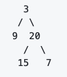
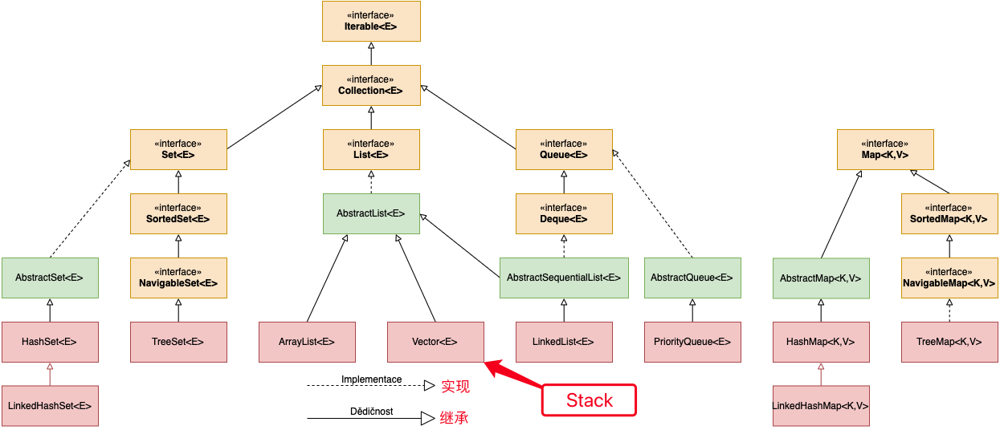
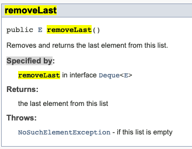
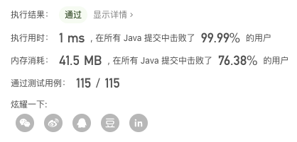
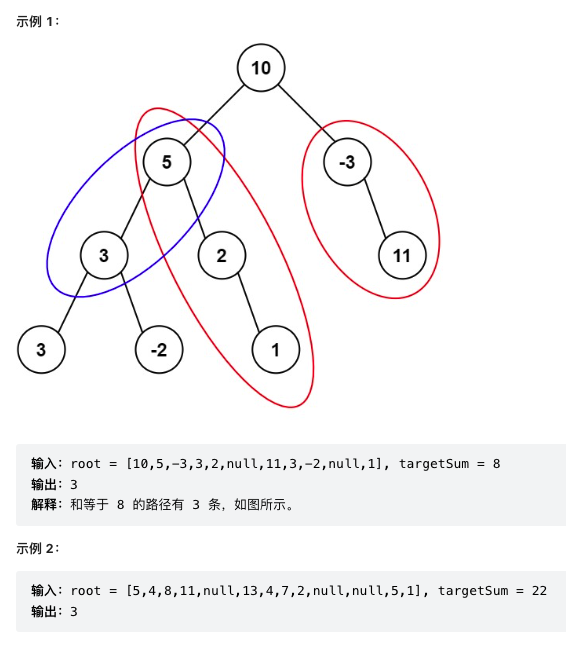
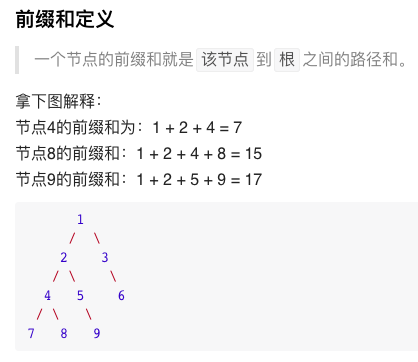

[toc]

# 树 Tree



数据结构中所谓的树，本身就是一个递归结构，一个树或者是空树，或者是有指针指着更小的树，所以很多树的问题，可以使用递归来处理。

树这种数据结构一般不会造成重复的查找，所以这里暂时不会太考虑 dynamic programming 相关的 memoization 相关的事。

当重复查找的情况出现时，要从数的遍历情况进行优化，或者使用回溯法进行优化。

递归，recursion，即函数自己调用自己，curve 是弯曲的意思，或者向内卷起来的意思，前面加 re 就是重复的弄，即一层又包着另一层，也就是函数自己调用自己，类似于 $$f(f(x))$$

我理解的递归，注重过程，相信过程，把结果交给过程。

## Leetcode 104 树的高度

树的最大深度

```java
/**
 * 最经典的一个题目，树的最大深度，或者说树的高度
 * 传统的递归思想
 * 我将递归思想总结为：将复杂问题的解丢给递归函数，只追求过程间的逻辑
 * */
    public int maxDepth(TreeNode root) {
        if (root == null) return 0; // 这里最好写空树的时候返回0，因为这样可以保证走到最后
        return Math.max(maxDepth(root.left), maxDepth(root.right)) + 1;
    }
```

## Leetcode 110 平衡树

判断一个数是否是平衡树，平衡树任何子树的左右子树高度差都小于等于 1。

```java
/**
 * 第一反应：如果配合最大深度的函数来解题的话，如果是分开用两个函数，那么会导致重复查找
 * 找了之前的代码，只要把判断平衡这步加到最大深度函数中即可
 * 这里还有一个反相的思维：
 *     即找反例
 *     找是平衡二叉树不好找，那就找非平衡二叉树，发现不是就返回
 * 该题其实是前面最大深度函数的变形，只要在最大深度函数中每个节点都去判断是否平衡即可
 * */
    private boolean result = true; // 用一个全局变量 result 表示结果，该变量初始化为 true，找到反例变成 false
    public boolean isBalanced(TreeNode root) {
        isBalancedMaxDepth(root);
        return result;
    }
    private int isBalancedMaxDepth(TreeNode root) { //主要就是这个函数，这是max depth的变形，加了平衡的判断
        if (root == null) return 0;
        int depthOfLeft = isBalancedMaxDepth(root.left);
        int depthOfRight = isBalancedMaxDepth(root.right);
        if (Math.abs(depthOfLeft - depthOfRight) > 1) result = false;
        return Math.max(depthOfLeft, depthOfRight) + 1;
    }
```

>当一个问题从正面不好入手时要有反相的思维，以退为进

## Leetcode 543 二叉树的直径，或者叫最长路径

注意：这个路径不一定经过根节点，即只要是二叉树的一个路径就行

```java
/**
 * 我认为依旧是最大深度的变形，只是这次要在每个节点加上统计左右树深度相加的值
 * 并且记录这个值的最大值
 * */
 
    private int diameter = 0; // 关于这种记录的问题，依旧使用一个全局变量来记录
    public int diameterOfBinaryTree(TreeNode root) {
        maxDepth(root);
        return diameter;
    }
    private int maxDepth(TreeNode root) {
        if (root == null) return 0;
        int depthOfLeft = maxDepth(root.left);
        int depthOfRight = maxDepth(root.right);
        diameter = Math.max(diameter, depthOfLeft + depthOfRight);
        return Math.max(depthOfLeft, depthOfRight) + 1;
    }
```

主要的操作还是在给 maxDepth 加了一些额外操作。

## Leetcode 226 翻转树

```java
/**
 * 经典题目
 * 对于每一个小的子结构，这里我所说的子结构指的是只有一个根节点和两个子节点的小结果
 * 翻转，无非就是让其左右的树换一下，这就是过程，这就是整个问题中一个小的通用的过程
 * 如果每个小的子结构都能实现这样的翻转，那么整个树将得到翻转
 * */
    public TreeNode invertTree(TreeNode root) {
        if (root != null) {
            TreeNode newRight = invertTree(root.left);
            TreeNode newLeft = invertTree(root.right);
            root.left = newLeft;
            root.right = newRight;
        }
        return root;
    }
```

或者可以理解为，这个函数的逻辑是，同样用这个函数翻转左右子树后，左右子树换位置。

## Leetcode 617 归并两树

题目要求：

```
Input:
       Tree 1                     Tree 2
          1                         2
         / \                       / \
        3   2                     1   3
       /                           \   \
      5                             4   7

Output:
         3
        / \
       4   5
      / \   \
     5   4   7
```

```java
/**
 * 树中的递归：对于左子树的事，将左子树当成新树交给函数，右边亦然，我们只注重当前这个节点的事
 * */
    public TreeNode mergeTrees(TreeNode root1, TreeNode root2) {
        if (root1 == null) return root2;
        else if (root2 == null) return root1;
        else {
            root1.val += root2.val;
            root1.left = mergeTrees(root1.left, root2.left);
            root1.right = mergeTrees(root1.right, root2.right);
            return root1;
        }
    }
```

## Leetcode Path Sum 1,2,3

在说这三道题目之前，首先介绍一下 Java 自带的数据结构 Java Collection Framework 背后的逻辑，即说明一些使用的误区：

# Java Collection Framework

Java 的 util 中自带数据结构，以下为Java util 数据结构的关系图。



图中缺了一个类，这里补充一下，Stack 类继承 Vector 类，但现在 Java 官方已经不推荐用 Stack，可以用 Deque 代替。

> 图来自于一位捷克🇨🇿网友，两个图例的注解原作者写成了捷克语，第一个词和英语很像可以猜到是实现的意思，从图中也可以看出是类实现接口，第二个词经查阅后得到是继承的意思，即类之间的继承。

## ArrayList 和 LinkedList

ArrayList和LinkedList都实现了List接口，有以下的不同点： 

1、ArrayList是基于索引的数据接口，它的底层是数组。它可以以O(1)时间复杂度对元素进行随机访问。与此对应，LinkedList是以元素列表的形式存储它的数据，每一个元素都和它的前一个和后一个元素链接在一起，在这种情况下，查找某个元素的时间复杂度是O(n)。
2、相对于ArrayList，LinkedList的插入，添加，删除操作速度更快，因为当元素被添加到集合任意位置的时候，不需要像数组那样重新计算大小或者是更新索引。
3、LinkedList比ArrayList更占内存，因为LinkedList为每一个节点存储了两个引用，一个指向前一个元素，一个指向下一个元素。

### 关于 LinkedList 的 removeLast()

对于这些函数使用比较迷惑的地方，要去查阅Java的官方文档，养成好的习惯。关于这个函数，Java指定了Deque时才能使用，官方文档的原文如下：



### 关于 LinkedList 之间的深拷贝

用 new LinkedList(oldOne) 即可。

## Deque

Deque是⼀个双端队列接⼝，继承⾃Queue接⼝，Deque的实现类是LinkedList、ArrayDeque、LinkedBlockingDeque，其中
LinkedList是最常⽤的。
Deque有三种⽤途：

```java
普通队列(⼀端进另⼀端出):
	Queue queue = new LinkedList() 或 Deque deque = new LinkedList()

双端队列(两端都可进出)
  Deque deque = new LinkedList()

堆栈
  Deque deque = new LinkedList()
```

> 注意：Java堆栈Stack类已经过时，Java官⽅推荐使⽤Deque替代Stack使⽤。Deque堆栈操作⽅法：push()、pop()、peek()。

名称 deque 是“double ended queue（双端队列）”的缩写，通常读为“deck”。

## Set

即集合的意思，已经是比较常用的数据类型，在哈希类的题目中有时会使用，接口写 Set，实现写 HashSet。

## Map

关于Map 字典，我们常用的方式是接口写 Map，实现写 HashMap。

# Path Sum

## Path Sum 1

给你二叉树的根节点 root 和一个表示目标和的整数 targetSum 。判断该树中是否存在 根节点到叶子节点 的路径，这条路径上所有节点值相加等于目标和 targetSum 。如果存在，返回 true ；否则，返回 false 。

```java
/**
 * Path Sum 1
 * 往下找即可，找到的判断标准是，刚好等于 target number，并且是叶子节点
 * */
public boolean hasPathSum(TreeNode root, int targetSum) {
    if (root == null) return false; // 直接是空，一般用于直接输入了空树
    else if (root.val == targetSum && root.left == null && root.right == null) return true; // 刚好找到
    else { // 继续往下找
        return hasPathSum(root.left, targetSum - root.val) || hasPathSum(root.right, targetSum - root.val);
    }
}
// 主要是审题，这里说了根节点到叶子节点才算一个路径，没有转弯的情况，说明题目题目给的已经非常简单了
// 注意 val 有正有负
```



## Path Sum 2

给你二叉树的根节点 root 和一个整数目标和 targetSum ，找出所有 从根节点到叶子节点 路径总和等于给定目标和的路径。

叶子节点 是指没有子节点的节点。

```java
/**
 * Path Sum 2
 * 统计所有等于 target number 的路径，并且要记录路径
 *
 * 其实解题的逻辑倒不是很难
 * 这里比较复杂的操作就是 Java 的各种数据结构的转换
 *
 * 解题的话，在 1 的基础上，我们传递一个 LinkedList，注意只传递这一个 LinkedList
 * 通过在不同地方时增减 val 来保证只用这一个 LinkedList 就可以模拟所有的情况
 *
 * 每当找到一个正确的序列时，深拷贝这个 LinkedList，保存到最终结果中
 * */
List<List<Integer>> resultList = new LinkedList<>();
Deque<Integer> mylist = new LinkedList<>();
public List<List<Integer>> pathSum2(TreeNode root, int targetSum) {
    pathSumWithList(root, targetSum, mylist);
    return resultList;
}
private void pathSumWithList(TreeNode root, int targetSum, Deque<Integer> mylist) {
    if (root == null) return;
    else if (root.val == targetSum && root.left == null && root.right == null) { // 找到了
        mylist.add(root.val);
        resultList.add(new ArrayList<>(mylist));
        mylist.removeLast(); // 用完之后 remove last
        return;
    } else {
        mylist.add(root.val);
        pathSumWithList(root.left, targetSum - root.val, mylist); // 往左树找
        pathSumWithList(root.right, targetSum - root.val, mylist); // 往右树找
        mylist.removeLast();
        return;
    }
}
```

向下找的逻辑其实就是DFS深度优先搜索，或者说先序遍历，用这样的走法模拟所有情况；还有一个好处是，通过按一定顺序增减元素，只用一个 LinkedList 就可以模拟所有情况了。

> 这里引发一个思考，有时间可以深入研究一下回溯法

## Path Sum 3

> 有一些难度的题目，重点理解前缀和的意义

给定一个二叉树的根节点 root ，和一个整数 targetSum ，求该二叉树里节点值之和等于 targetSum 的 路径 的数目。

路径 不需要从根节点开始，也不需要在叶子节点结束，但是路径方向必须是向下的（只能从父节点到子节点）。



```java
 /**
     * Path Sum 3
     *
     * 给定一个二叉树的根节点 root，和一个整数 targetSum ，求该二叉树里节点值之和等于 targetSum 的 路径 的数目。
     * 路径 不需要从根节点开始，也不需要在叶子节点结束，但是路径方向必须是向下的（只能从父节点到子节点）。
     * */
//    private int resultCount = 0;
//    private int oldTarget = 0;
//    public int pathSum(TreeNode root, int targetSum) {
//        if (root == null) return resultCount;
//        oldTarget = targetSum;
//        fromThisNode(root);
//        return resultCount;
//    }
//    private void currentTarget(TreeNode root, int targetSum) {
//        if (root == null) return;
//        if (root.val == targetSum) resultCount++;
//        currentTarget(root.left, targetSum - root.val);
//        currentTarget(root.right, targetSum - root.val);
//    }
//    private void fromThisNode(TreeNode root) {
//        if (root == null) return;
//        if (root.val == oldTarget) resultCount++;
//        fromThisNode(root.left);
//        fromThisNode(root.right);
//        currentTarget(root.left, oldTarget - root.val);
//        currentTarget(root.right, oldTarget - root.val);
//    }

    /**
     * 这道题需要我们对过程有更深刻的理解
     *
     * 当题目处在一个多变的条件中，我们要从确定的东西开始
     * 题目看起来路径不从根节点开始了，但实际解决问题时，我们还是当作从根节点开始，只是把每个节点都当成根节点
     * 在这道题目中路径是比较随意的，但我们可以定下路径的起点，通过路径的起点进行分情况讨论
     * 对于一棵树，路径的起点无非在：1 根节点，或者 2 左树的某个节点，或者 3 右树的某个节点
     *
     * 对于 2 这种情况，结果为 pathSum(root.left, sum)，即把左树带到这个函数中即可
     * 这就是对过程的抽象，相信过程，把结果交给过程
     * 3 这种情况亦然
     *
     * 所以问题就变成了，根节点为起点，找有多少个符合条件的路径，即我们要写的函数：
     * private int pathSumStartWithRoot(TreeNode root, int sum)
     * 写这个函数并不难，每次根据 val 减 target 的值即可
     * 这里注意的是，即使对了，也不要停（不要忙着 return）比如 1->(-2) 对了, 继续向下可能有 1->(-2)->(-1)->1 这种情况，前面对的话，那么这个就也是对的
     * */
    public int pathSum(TreeNode root, int sum) {
        if (root == null) return 0;
        int ret = pathSumStartWithRoot(root, sum) + pathSum(root.left, sum) + pathSum(root.right, sum);
        return ret;
    }

    private int pathSumStartWithRoot(TreeNode root, int sum) {
        if (root == null) return 0;
        int ret = 0;
        if (root.val == sum) ret++;
        ret += pathSumStartWithRoot(root.left, sum - root.val) + pathSumStartWithRoot(root.right, sum - root.val);
        return ret;
    }
    /**
     * 更多的去体会函数的意思，不要陷在函数的具体实现中，要体会函数抽象的意义，体会抽象背后的逻辑
     * */
    //leetcode测试中，我的方法和大神的方法运行速度和内存消耗并没有很大区别（甚至我写的冗余的代码还略快2ms）
    /**
     * 优化：
     *      可以看到每个节点不止别遍历了一遍，所以这绝不是最佳的解法，相反，这是一个时间复杂度比较高的解法
     *      我们可以粗略的认为每个节点都被当成起点去遍历了其他的所有节点，所以时间复杂度是 n 乘 n，即平方的复杂度（粗略计算）
     *      我们希望能够尽力优化到每个点只遍历一次，这种最优情况
     * */

```

优化，首先解释前缀和：



```java
/**
     * 这里提到一种叫 前缀和 的方法（prefix）
     * https://leetcode-cn.com/problems/path-sum-iii/solution/dui-qian-zhui-he-jie-fa-de-yi-dian-jie-s-dey6/
     *
     * 一个节点的前缀和就是该节点到根之间的路径和
     *
     * 题目要求的是找出路径和等于给定数值的路径总数, 而:
     * 两节点间的路径和 = 两节点的前缀和之差
     *
     * 当我们讨论两个节点的前缀和差值时，有一个前提：
     * 一个节点必须是另一个节点的祖先节点
     *
     * 理解了这个之后，问题就得以简化：
     * 我们只用遍历整颗树一次，记录每个节点的前缀和，并查询该节点的祖先节点中符合条件的个数，将这个数量加到最终结果上。
     *
     * 即保证长的那条路径包括短的那条路径
     * 用先序遍历的方法，能保证当遍历到一个节点 X 时，之前遍历的节点 B 一定在路径 OX 中，这里的 O 指的是根节点
     * 注意这里会有很重要的一个操作，就是遍历完自己也遍历完左子树右子树后，把自己去除掉
     * 这个去除的动作至关重要，可以保证这里的操作不影响另一个子树上的操作
     * (即当我们要遍历5，9这个子树时，要把 Map 中记录的 4，7，8这部分子树的情况都删掉)
     * */
    private int oldTarget = 0;
    private Map<Integer, Integer> prefixMap = new HashMap<>();
    public int pathSum4(TreeNode root, int sum) {
        if (root == null) return 0;
        oldTarget = sum;
        prefixMap.put(0, 1);
        return dfs(root, 0);
    }
    private int dfs(TreeNode root, int currentSum) {
        int result = 0;
        if (root == null) return result;
        currentSum += root.val;
        int here = prefixMap.getOrDefault(currentSum - oldTarget, 0); // 这个 here 很精髓，指的是在这里结束
        prefixMap.put(currentSum, prefixMap.getOrDefault(currentSum, 0) + 1); // 把自己这里的前缀和 put 进去
        int left = dfs(root.left, currentSum); // 在左树上结束有多少可能的路径
        int right = dfs(root.right, currentSum); // 在右树上结束有多少可能的路径
        result = here + left + right; // 三种情况的可能路径数加一起
        prefixMap.put(currentSum, prefixMap.get(currentSum) - 1); // 去除在自己这里结束的这种情况
        return result;
    }
    // 体验 dfs 深度优先搜索，体验先序遍历
```


## 相同节点值的最大路径长度 687 Longest Univalue Path 

```
             1
            / \
           4   5
          / \   \
         4   4   5

Output : 2
```

反思一下这道题

```java
private int path = 0;

public int longestUnivaluePath(TreeNode root) {
    dfs(root);
    return path;
}

private int dfs(TreeNode root){
    if (root == null) return 0;
    int left = dfs(root.left);
    int right = dfs(root.right);
    int leftPath = root.left != null && root.left.val == root.val ? left + 1 : 0;
    int rightPath = root.right != null && root.right.val == root.val ? right + 1 : 0;
    path = Math.max(path, leftPath + rightPath);
    return Math.max(leftPath, rightPath);
}
```

本题属于：树、dfs 类型的题目

* 全局变量 path：首先本题要找到最大长度的话，从做题的角度，显然用一个全局变量来记录会比较简化思维，如果用返回值的话，会使函数变得复杂，函数的返回值我们有其他用处，不一定返回值就一定是题目的答案
* DFS：开始DFS，DFS 的基本原理就是 dfs(root) 里面会有 dfs(root.left) 和 dfs(root.right)，这里的 dfs 返回的其实是从这个节点向下最长的一个路径有多长，但是在算这些东西的过程中，也算了左右的求和，这个求和的值会和最终答案path比较，保留最长的一个。所以 DFS 这个函数是有两个功能：
  1. 以这个 root 为根节点，找一个左右都有的路径，记录这个路径的长度并和最终结果比较更新，这个功能通过全局变量实现。
  2. 以这个 root 为根节点，找到左右两边那边的路径更长，并返回这个更长的单边的路径。
* 关于判断空，判断叶子节点等等，其实这些情况不用考虑这个么多，最重要的是有空的时候的处理就好。

# 问题分类：二叉树的路径问题

