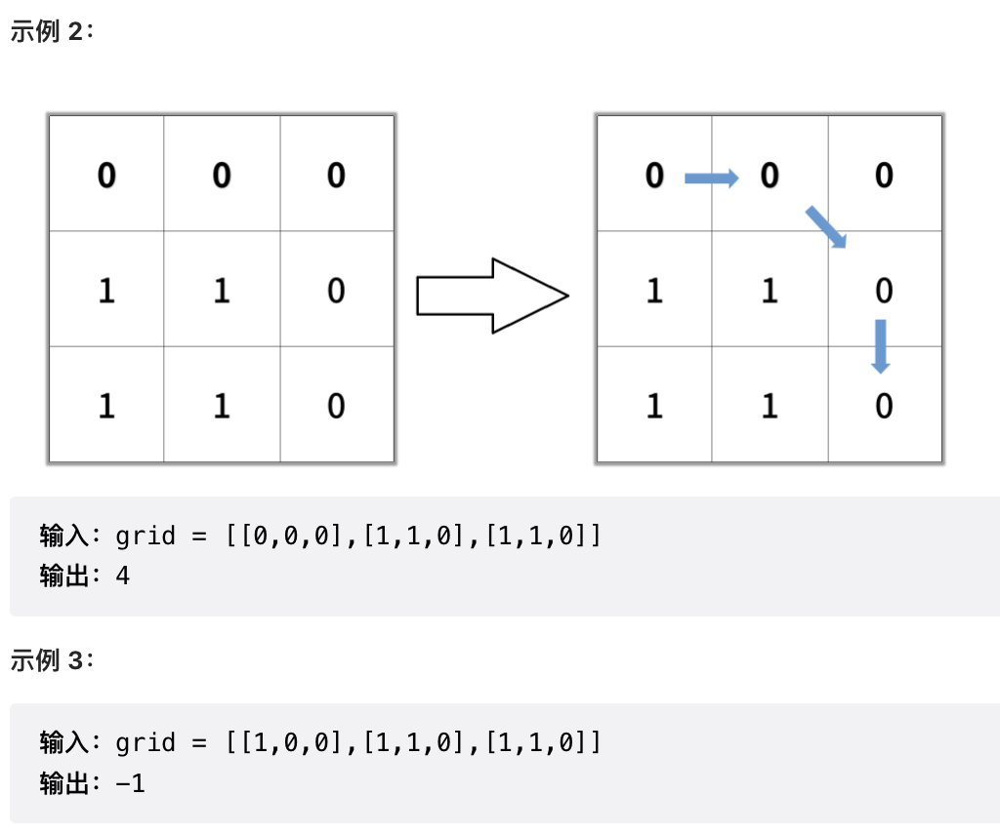
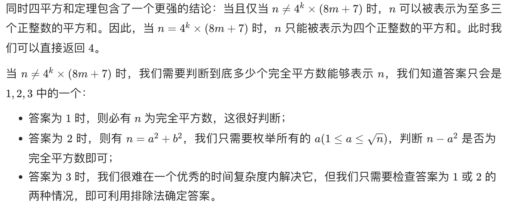
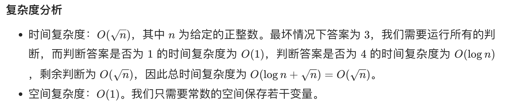

# Search

[toc]

深度优先搜索和广度优先搜索广泛运用于树和图中，但是它们的应用远远不止如此。

## BFS


广度优先搜索一层一层地进行遍历，每层遍历都是以上一层遍历的结果作为起点，遍历一个距离能访问到的所有节点。需要注意的是，遍历过的节点不能再次被遍历（遍历过的节点一定要标记为已经遍历了）。

第一层：

- 0 -> {6,2,1,5} （或者我叫做第一圈）

第二层：

- 6 -> {4}
- 2 -> {}
- 1 -> {}
- 5 -> {3}

第三层：

- 4 -> {}
- 3 -> {}

每一层遍历的节点都与根节点距离相同。设 $d_i$ 表示第 i 个节点与根节点的距离，

推导出一个结论：对于先遍历的节点 i 与后遍历的节点 j，一定有 $d_i$ <= $d_j$。

利用这个结论，可以求解 **最短路径** 等 **最优解** 问题：第一次遍历到目的节点，其所经过的路径为最短路径。

应该注意的是，使用 BFS 只能求解 **无权图** 的最短路径，无权图是指从一个节点到另一个节点的代价都记为 1。

在程序实现 BFS 时需要考虑以下问题：

- 队列：用来存储每一轮遍历得到的节点；
- 标记：对于遍历过的节点，应该将它标记，防止重复遍历。

### BFS-1 Leetcode 1091 ShortestPathinBinaryMatrix



```java
		/**
     * 这里加入了 BFS 的一个重要思想：标记 ！！
     * 简而言之就是走过的点一定不再走了
     *
     * 在图里走，方向用小数组
     *
     * 走 BFS 要走一圈一圈走这种概念
     *
     * */
    public int shortestPathBinaryMatrix(int[][] grids) {
        int[][] direction = {{1, -1}, {1, 0}, {1, 1}, {0, -1}, {0, 1}, {-1, -1}, {-1, 0}, {-1, 1}}; // 可能走的方向
        int n = grids.length;
        Queue<Node> queue = new LinkedList<>(); // 用一个队列搞 BFS，队列中存的是一个 pair
        queue.add(new Node(0, 0)); // 把第一个放进去
        int pathLength = 0; // 记录走了多长
        while (!queue.isEmpty()) { // 队列不空就继续向下走
            int size = queue.size(); // 这一轮要遍历多少个
            pathLength++; // 走一轮路径长度肯定加一
            while (size-- > 0) { // 开始走这一轮，或者说这一圈
                Node cur = queue.poll(); // 从队列中拿出一个 Node
                int currRow = cur.row, currCol = cur.col;
                if (grids[currRow][currCol] == 1) continue; // 如果是 1 直接跳过这个点了
                if (currRow == n - 1 && currCol == n - 1) return pathLength; // 如果到最后说明结束了，已经找到最短路径了
                grids[currRow][currCol] = 1; // 标记。这个点走完，要把自己标记掉，防止走回头路
                for (int[] d : direction) { // 八个方向走下一轮
                    int nowRow = currRow + d[0], nowCol = currCol + d[1];
                    if (nowRow < 0 || nowRow >= n || nowCol < 0 || nowCol >= n) continue; // 如果位置超出图 直接不走这个了
                    queue.add(new Node(nowRow, nowCol)); // 点合理，加入队列，下一轮再搞
                }
            }
        }
        return -1; // 如果没有找到路径，返回 -1，找不到
    }

    private class Node {
        int row;
        int col;
        Node(int r, int c) {
            row = r;
            col = c;
        }
    }
    /**
     * 我体会的 BFS 的模版：
     *
     * 1 弄一个队列，把第一个点放进去
     * 2 从队列中取一个点，把这个点的相邻的放到队列后面，把这个点标记成已遍历
     * 3 每弄这么一轮，就相当于路径走了 1，路径加一
     * */
```

### BFS-2 Leetcode 279 PerfectSquares

**示例 1：**

```
输入：n = 12
输出：3 
解释：12 = 4 + 4 + 4
```

**示例 2：**

```
输入：n = 13
输出：2
解释：13 = 4 + 9
```

#### 方法1：动态规划（官方方法）

我们可以依据题目的要求写出状态表达式：$f[i]$ 表示最少需要多少个数的平方来表示整数 $i$。

这些数必然落在区间 $[1,\sqrt{n}]$ 。

我们可以枚举这些数，假设当前枚举到 $j$，那么我们还需要取若干数的平方，构成 $i-j^2$ 。此时我们发现该子问题和原问题类似，只是规模变小了。这符合了动态规划的要求，于是我们可以写出状态转移方程。
$$
f[i]=1+\min_{j=1}^{\lfloor\sqrt{i}\rfloor}{f[i-j^2]}
$$
其中 $$f[0]=0$$ 为边界条件，实际上我们无法表示数字 0，只是为了保证状态转移过程中遇到 j 恰为 $\sqrt{i} $ 的情况合法。

同时因为计算 $f[i]$ 时所需要用到的状态仅有 $f[i-j^2]$，必然小于 i，因此我们只需要从小到大地枚举 i 来计算 $f[i]$ 即可。

**一个重点就在于，对于这个数 i ，我们一定可以写成 i = j 的平方 + k，这里 k 是数个平方的和，而这个 k 我们肯定是之前研究过的！**

复杂度分析

* 时间复杂度：$O(n\sqrt{n})$ ，其中 n 为给定的正整数。状态转移方程的时间复杂度为 $O(\sqrt{n})$ ，共需要计算 n 个状态，因此总时间复杂度为 $O(n \sqrt{n})$。

* 空间复杂度：O(n)。我们需要 O(n) 的空间保存状态。

```java
    public int numSquares2(int n) {
        int[] f = new int[n + 1];
        for (int i = 1; i <= n; i++) {
            int minn = Integer.MAX_VALUE;
            for (int j = 1; j * j <= i; j++) {
                minn = Math.min(minn, f[i - j * j]);
            }
            f[i] = minn + 1;
        }
        return f[n];
    }
```

#### 方法2：数学（官方方法）

该题目还是需要一点数学知识的。或者说从数学上多考虑考虑，题目会简单很多。

**四平方和定理** （英语：Lagrange's four-square theorem） 说明每个正整数均可表示为4个整数的平方和。

这就是这道题的上界。



```java
class Solution {
    public int numSquares(int n) {
        if (isPerfectSquare(n)) {
            return 1;
        }
        if (checkAnswer4(n)) {
            return 4;
        }
        for (int i = 1; i * i <= n; i++) {
            int j = n - i * i;
            if (isPerfectSquare(j)) {
                return 2;
            }
        }
        return 3;
    }

    // 判断是否为完全平方数
    public boolean isPerfectSquare(int x) {
        int y = (int) Math.sqrt(x);
        return y * y == x;
    }

    // 判断是否能表示为 4^k*(8m+7)
    public boolean checkAnswer4(int x) {
        while (x % 4 == 0) {
            x /= 4;
        }
        return x % 8 == 7;
    }
}
```



**了解一下即可，对数学水平的要求太高**

#### 方法3：BFS

自己写了一个 BFS，但是超时，这里一张图很好的说明了怎样的一棵树会更快：

```
        12
      / |  \
     3  8  11
    /  /|  | \ \
   2  4 7  2  7 10
  /  /  |  |  |  |
 1  0   3  1  3  1
/
0
```

从大到小来，每次走一个平方数，到零的时候就是走到结尾了

这种的树的情况，比自己的 0 作为根节点然后逐渐变大的速度更快，不过两种方式都过了


## DFS


深度优先搜索在得到一个新节点时立即对新节点进行遍历：

从节点 0 出发开始遍历，得到到新节点 6 时，立马对新节点 6 进行遍历，得到新节点 4；

如此反复以这种方式遍历新节点，直到没有新节点了，此时返回。

返回到根节点 0 的情况是，继续对根节点 0 进行遍历，得到新节点 2，然后继续以上步骤。

从一个节点出发，使用 DFS 对一个图进行遍历时，能够遍历到的节点都是从初始节点可达的，DFS 常用来求解这种 **可达性** 问题。

在程序实现 DFS 时需要考虑以下问题：

- 栈：用 **栈** 来保存当前节点信息，当遍历新节点返回时能够继续遍历当前节点。可以使用递归栈。
- 标记：和 BFS 一样同样需要对已经遍历过的节点进行标记。

题目：

* 695 是 图论 DFS 开山鼻祖一样的题目，是模版题，一通百通！
* 130 和 417 两个题目是经典的反向思维的做法，比正面去想简单了太多！！！！一定要掌握这种以退为进的思路，反复学习！


## Backtracking

Backtracking（回溯）属于 DFS。

- 普通 DFS 主要用在 **可达性问题** ，这种问题只需要执行到特点的位置然后返回即可。
- 而 Backtracking 主要用于求解 **排列组合** 问题，例如有 { 'a','b','c' } 三个字符，求解所有由这三个字符排列得到的字符串，这种问题在执行到特定的位置返回之后还会继续执行求解过程。

因为 Backtracking 不是立即返回，而要继续求解，因此在程序实现时，需要注意对元素的标记问题：

- 在访问一个新元素进入新的递归调用时，需要将新元素标记为已经访问，这样才能在继续递归调用时不用重复访问该元素；
- 但是在递归返回时，需要将元素标记为未访问，因为只需要保证在一个递归链中不同时访问一个元素，可以访问已经访问过但是不在当前递归链中的元素。

